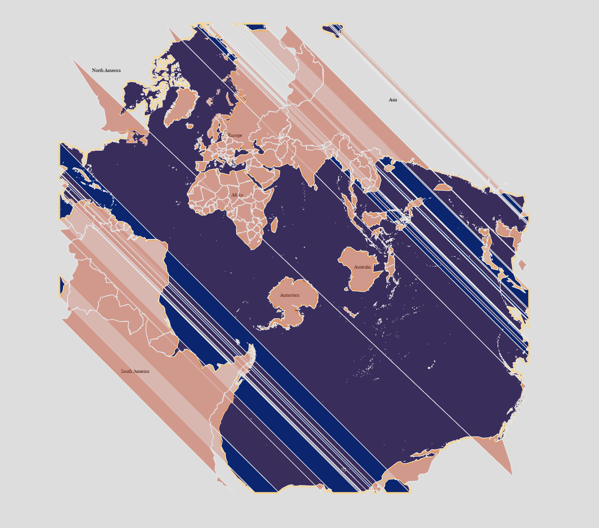
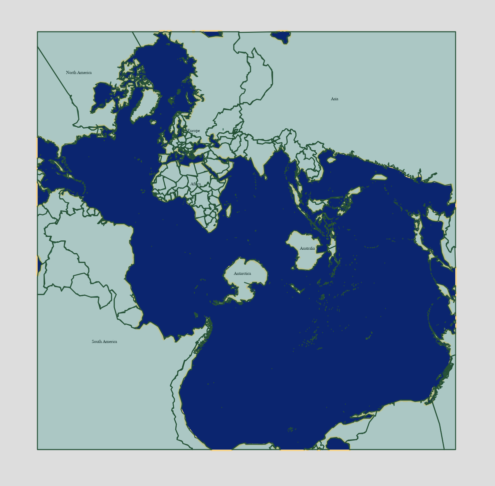

# Spilhaus Reprojection App

## Overview

This project is a web application for uploading GeoJSON data, transforming it into the Spilhaus projection, and repairing stray-line artifacts caused by reprojection. The static website also offers a basemap for viewing the transformed data.

## Motivation

Reprojecting geometries into the Spilhaus projection can introduce unexpected long stray lines near projection seams. This app was built to automate that repair workflow and make the results easier to inspect. See below for an example of the world map before and after repair.

- Stray lines appear because projection seams are not added back to the reprojected dataframe.  
  

- World map after repair.  
  

## Features

- Upload GeoJSON files
- Transform geometries into ESRI:54099 / Spilhaus projection
- Detect and repair reprojection-related stray lines
- Visualize processed results in a web interface
- Return cleaned geometry output

## Tech Stack

Python, Flask, GeoPandas, Shapely, NumPy, PyProj, JavaScript, and Leaflet

## Methods and Key Functions

This app first derives the Spilhaus projection seam in EPSG:4326 coordinates. It then identifies and counts the intersections between the seam and the input geometry. Using these intersection points, the geometry is split into smaller segments to isolate reprojection-induced stray lines. The resulting segments are then reassembled along the Spilhaus seam to reconstruct a valid geometry, which is returned as the final output.

- **`to_360` (`script.workflow`)**  
  Rewraps geometries into a continuous 0–360 longitude space so that features crossing the antimeridian can be processed without being artificially split at 180°E / 180°W.

- **`cut_ring_to_parts` (`script.repair_ring`)**  
  Splits polygon rings into smaller segments using NumPy-based operations such as `array`, `roll`, `norm`, and `argsort`, while preserving the original coordinate order.

- **`remake_polygon_for_ring` (`script.repair_ring`)**  
  Extends segment endpoints to locate intersections with the Spilhaus seam and reconnects segments as needed to form closed polygons.

- **`topology_for_polys`**  
  Re-evaluates the topological relationships among reconstructed polygons, including nested shells and newly generated holes, and returns a valid final geometry.

## Limitations

- **Assumption in longitude wrapping**  
  Geometries intersected by the prime meridian (0° longitude) are currently assumed not to also cross the 180°E / 180°W boundary. As a result, they are not passed through the `to_360` longitude-wrapping step. In theory, however, geometries may intersect both boundaries, and this case is not fully handled in the current implementation.

- **Engineering-based seam definition**  
  The boundary coordinates of the Spilhaus seam are currently identified through an engineering-based approach rather than derived analytically from a mathematical formula. While this method is effective in practice, it may be less generalizable or precise than a fully mathematical solution.

## Input Requirements

- Input data must be in GeoJSON format.
- Supported GeoJSON structures include `Feature` and `FeatureCollection`.
- Supported geometry types include `Polygon`, `MultiPolygon`, `Point`, `MultiPoint`, `LineString`, `MultiLineString`, and `GeometryCollection`.
- The current repair workflow is primarily designed for line and polygon-based geometries, especially `Polygon` and `MultiPolygon`, as point-based geometries do not have stray line problem.
